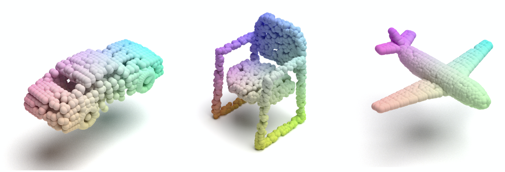

# Multiple Point Cloud Renderer using Mitsuba 2

Calling the script **render_mitsuba2_pc.py** automatically performs the following in order:

  1. generates an XML file, which describes a 3D scene in the format used by Mitsuba. 
  2. calls Mitsuba2 to render the point cloud into an EXR
  3. processes the EXR into a jpg file.
  4. iterates for multiple point clouds present in the tensor (.npy)
  
It could process both plys and npy. The script is heavily inspired by [PointFlow renderer](https://github.com/zekunhao1995/PointFlowRenderer) and here is how the outputs can look like:



## Dependencies
* Python 3.6
* [Mitsuba 2](http://www.mitsuba-renderer.org/)
* Used python packages for 'render_mitsuba2_pc' : OpenEXR, Imath, PIL

Ensure that Mitsuba 2 can be called as 'mitsuba' by following the [instructions here](https://mitsuba2.readthedocs.io/en/latest/src/getting_started/compiling.html#linux).
Also make sure that the 'PATH_TO_MITSUBA2' in the code is replaced by the path to your local 'mitsuba' file.

## Instructions

Replace 'PATH_TO_MITSUBA2' in the 'render_mitsuba2_pc.py' with the path to your local 'mitsuba' file. Then call:
```bash
# Render a single or multiple JPG file(s) as:
python3.6 render_mitsuba2_pc.py chair.npy

# It could also render a ply file
python3.6 render_mitsuba2_pc.py chair.ply
```

All the outputs including the resulting JPG files will be saved in the directory of the input point cloud. The intermediate EXR/XML files will remain in the folder and has to be removed by the user. 

